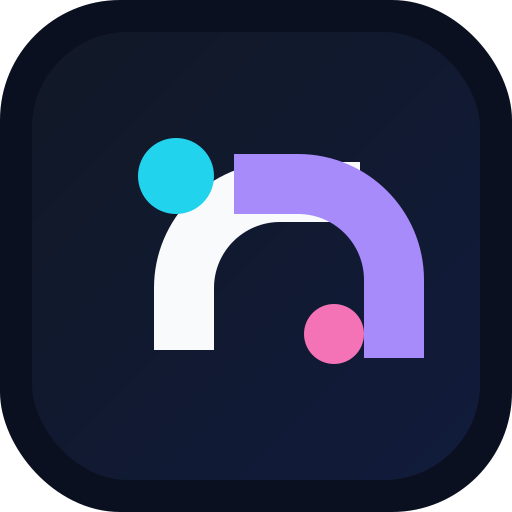
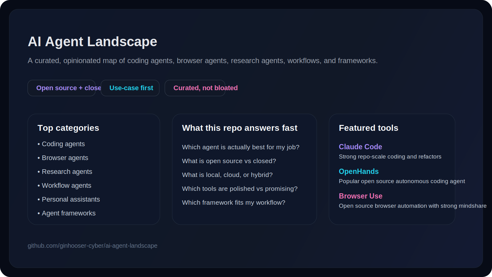

<p align="center">
  
</p>

<h1 align="center">AI Agent Landscape</h1>

<p align="center">
  <strong>A curated, opinionated map of the AI agent ecosystem.</strong><br/>
  Find the right tool for coding, browser automation, research, workflows, personal assistance, and agent development.
</p>

<p align="center">
  <a href="https://github.com/ginhooser-cyber/ai-agent-landscape/stargazers"></a>
  <a href="./LICENSE"></a>
  <a href="./CONTRIBUTING.md"></a>
  <a href="./docs/methodology.md"></a>
</p>

<p align="center">
  <a href="#-start-here">Start Here</a> •
  <a href="#-featured-picks">Featured Picks</a> •
  <a href="#-comparison-snapshot">Comparison Snapshot</a> •
  <a href="#-categories">Categories</a> •
  <a href="#-how-this-repo-thinks">How This Repo Thinks</a> •
  <a href="#-contributing">Contributing</a>
</p>

---



## Why this repo exists

The AI agent space is moving insanely fast.

That sounds exciting until you actually try to choose a tool.

Then it becomes:
- endless launch tweets
- shallow "top 10" lists
- stale comparisons
- weak distinctions between products, frameworks, assistants, and experiments

**AI Agent Landscape** is meant to be the practical map.

Not the biggest list.
Not the emptiest directory.
Not a dressed-up SEO farm.

The goal is simple: **help people find the right agent faster**.

## ⚡ Start Here

If you only spend 30 seconds here, use this flow:

### You want an agent to write or fix code
Start with **Claude Code**, **Codex CLI**, **Cursor**, **Aider**, **OpenHands**, or **Cline**.

### You want an agent to act on websites
Start with **Browser Use**, **Skyvern**, or **Stagehand**.

### You want deep web research and synthesis
Start with **Perplexity**, **OpenAI Deep Research**, **Gemini Deep Research**, or **Genspark**.

### You want to build your own agent systems
Start with **LangGraph**, **AutoGen**, **PydanticAI**, **smolagents**, **Semantic Kernel**, or **Mastra**.

### You want workflow automation with agent behavior
Start with **CrewAI**, **n8n**, **Flowise**, or **Dify**.

### You want a personal or operator-style assistant
Start with **OpenClaw**, **Open Interpreter**, **Khoj**, or **Letta**.

## 🔥 Featured Picks

These are not "the winners." They are the tools that currently stand out for clear reasons.

| Tool | Why it matters |
|------|----------------|
| **Claude Code** | One of the strongest coding agents for repo-scale reasoning, refactors, and architectural edits. |
| **Cursor** | Still one of the most mainstream agentic coding workflows because it feels natural inside the editor. |
| **Aider** | A practical OSS choice if you want a terminal-native coding assistant that stays close to git workflows. |
| **OpenHands** | One of the most visible open-source autonomous coding agents. Good mindshare, strong narrative, real OSS gravity. |
| **Browser Use** | One of the clearest open-source browser-agent projects people can grok fast. Great category representative. |
| **Perplexity** | Helped normalize research-style AI workflows for mainstream users. Still important as a reference point. |
| **LangGraph** | A serious choice for developers who want control, statefulness, and production-ish agent flows. |
| **PydanticAI** | Clean developer ergonomics and a strong "Python builders" appeal. |
| **CrewAI** | Popular for multi-agent and workflow-style orchestration, especially with builders shipping demos and internal tools. |
| **OpenClaw** | Interesting because it blends assistant behavior, messaging, browser control, tools, and device operations in one runtime. |

## 📊 Comparison Snapshot

| Tool | Category | Open Source | Hosting | Best For | Quick Take |
|------|----------|-------------|---------|----------|------------|
| Claude Code | Coding Agent | No | cloud | repo-scale coding | very strong for complex code work |
| Codex CLI | Coding Agent | No | cloud | code edits and generation | direct and useful for terminal coding loops |
| Cursor | Coding Agent | No | cloud | IDE-native dev workflows | probably the easiest entry for many app developers |
| Aider | Coding Agent | Yes | local/cloud | git-friendly code help | practical, lightweight, OSS-friendly |
| OpenHands | Coding Agent | Yes | local/cloud | autonomous coding tasks | strong OSS visibility and ambition |
| Cline | Coding Agent | Yes | local/cloud | VS Code agent loops | popular among tool-heavy tinkerers |
| Browser Use | Browser Agent | Yes | local/cloud | browser automation | excellent category clarity and OSS mindshare |
| Skyvern | Browser Agent | Yes | cloud/hybrid | web task automation | more operations-flavored browser automation |
| Stagehand | Browser Agent Tooling | Yes | local/cloud | browser action building | closer to building blocks than a turnkey agent |
| Perplexity | Research Agent | No | cloud | fast research and synthesis | one of the easiest products to recommend casually |
| OpenAI Deep Research | Research Agent | No | cloud | long-form research tasks | strong narrative, premium positioning |
| Gemini Deep Research | Research Agent | No | cloud | web-grounded synthesis | attractive when Google grounding matters |
| LangGraph | Agent Framework | Yes | local/cloud | controlled agent workflows | strong for serious builder stacks |
| AutoGen | Agent Framework | Yes | local/cloud | multi-agent orchestration | historically influential in the category |
| PydanticAI | Agent Framework | Yes | local/cloud | Pythonic agent development | elegant developer ergonomics |
| CrewAI | Workflow Agent / Framework | Yes | local/cloud | team-style workflows | big builder mindshare |
| n8n | Workflow Agent | Yes | local/cloud | automations with AI steps | huge practical workflow appeal |
| OpenClaw | Personal Assistant / Agent Runtime | Yes | local/self-hosted | cross-channel assistants | unusually broad orchestration surface |

## 🗂 Categories

### Coding Agents
Tools focused on writing, editing, refactoring, reviewing, or debugging code.

**Examples:** Claude Code, Codex CLI, Cursor, GitHub Copilot, Aider, OpenHands, Cline, Continue, Goose, Gemini CLI, Devin.

### Browser Agents
Tools that act on websites and web apps by browsing, clicking, extracting, and completing tasks.

**Examples:** Browser Use, Skyvern, Stagehand.

### Research Agents
Tools optimized for search, synthesis, citations, and broad investigation.

**Examples:** Perplexity, OpenAI Deep Research, Gemini Deep Research, Genspark, You.com research workflows.

### Workflow Agents
Tools that connect apps, APIs, documents, and actions into agentic business or operator flows.

**Examples:** CrewAI, n8n, Flowise, Dify.

### Personal Assistants
Agents that help across messages, tasks, files, notes, browser actions, and devices.

**Examples:** OpenClaw, Open Interpreter, Khoj, Letta.

### Agent Frameworks
Building blocks for developers who want to create custom agents and orchestrations.

**Examples:** LangGraph, AutoGen, Semantic Kernel, PydanticAI, Mastra, smolagents, LlamaIndex.

## 🧭 How to use this repo

This repo is for four kinds of people:

### 1. Developers choosing tools
You want the shortest path to the right agent for a real job.

### 2. Founders and operators
You want to understand which tools are real, which are hype, and which are worth integrating.

### 3. Builders comparing ecosystems
You want to see how products, frameworks, and open-source projects relate to each other.

### 4. Contributors and curators
You want to improve the map with better entries, better sources, and sharper distinctions.

## 🧠 How this repo thinks

This repo is **curated and opinionated**.

That means:
- we care more about usefulness than raw count
- we do not want a giant junk drawer of AI links
- we prefer short, honest notes over marketing language
- we want entries to answer "what is this actually good at?"

Read the full approach in [docs/methodology.md](./docs/methodology.md).

## 📁 Repo structure

```text
.
├── README.md
├── LICENSE
├── CONTRIBUTING.md
├── assets/
│   ├── hero.svg
│   └── logo.svg
├── data/
│   ├── agents.csv
│   └── categories.md
├── docs/
│   └── methodology.md
└── .github/
    └── ISSUE_TEMPLATE/
```

## 🛣 Roadmap

- [x] Ship a credible public repo structure
- [x] Add visual identity assets
- [x] Publish an initial comparison snapshot
- [ ] Expand the dataset to 75+ strong entries
- [ ] Add sharper pricing / hosting / licensing metadata
- [ ] Add category-specific shortlists and buying guides
- [ ] Add generated website / docs experience
- [ ] Add changelog and update cadence
- [ ] Add "best by use case" pages

## 🤝 Contributing

Contributions are welcome, especially if you can help with:
- missing tools worth tracking
- stale pricing or licensing info
- category cleanup
- better descriptions
- clearer sourcing
- more useful comparison criteria

Before opening a PR, please read [CONTRIBUTING.md](./CONTRIBUTING.md).

## ⭐ Star this repo

If this repo saves you time, helps you choose faster, or gives you a better mental model of the agent ecosystem, give it a star.

## License

MIT
